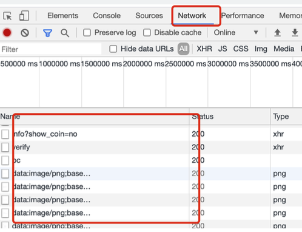

# 基于HAR的视频下载器


## 用途


下载网站上的视频

（目前经过测试，高顿网课等网站可以用🤫）

本项目基于mac系统开发，可用于Linux和Mac系统，在windows系统上运行可能会出现不兼容的问题，可根据情况修改逻辑

**警告：请勿将此项目用于非法用途，下载下来的视频请勿非法出售传播，尊重知识产权！！！！！**

## 安装

```
git clone https://github.com/jiangph1001/gaodun_download.git
pip install Crypto
```


## 运行

按F12打开chrome的开发者模式，找到Network选项，然后刷新视频播放的页面，下面会出现一些记录



右键选择任意一条记录，找到`Save all as HAR with content`，保存到程序目录下的`HAR`文件夹中，例如此处命名为`test.har`


然后执行命令即可开始下载

```
python3 download.py
```


## 备注

- har目录下**不要放**不是har的文件
- 文件名必须以`.har`结尾
- 最后生成的视频文件名与har文件名和时间有关，例如
  - 保存的是`test.har`
  - 最后生成的视频文件是`test.ts`
- 可以往har文件夹中可以放入尽可能多的har文件，会依次下载
- 下载成功后，har文件会自动删除
- 可能存在因网络问题导致下载失败的情况，重新运行即可
- 代码中设定的多进程，一次可以同时下载3个文件（但是可以放很多个文件进去，都能下载完）


## 故障解决

1. 运行时提示找不到Crypto这个库

   可考虑将`/usr/local/lib/python3.9/site-packages/`（具体位置视情况而定）下的crypto文件重命名为Crypto

2. 个别HAR文件无法下载

   已经知道该情况出现的原因，但还没有解决方法

